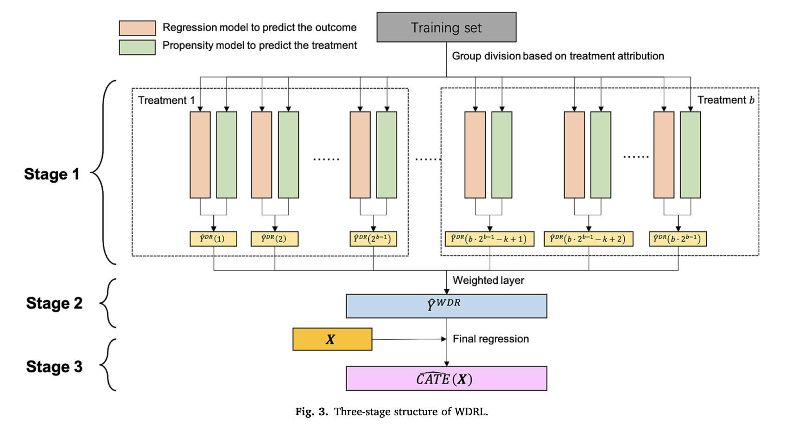

# Uplift modeling with weighted doubly robust learning

This repo contains a Python implementation of _weighted doubly robust learning_, due to Zhan, et al. (2024). It is a method of uplift modeling to recover causal effects of treatments in the presence of treatment confounding. For instance, a company may issue multiple coupons to individual customers during an ad campaign. This method, borrowing from Shapley values, is designed to disentangle each treatment's effect.

The diagram below captures the essentials elements of the algorithm:

The two notebooks in the repo demonstrate good performance on simulated data under different conditions

## Reference

Zhan, B., Liu, C., Li, Y. and Wu, C., 2024. Weighted doubly robust learning: An uplift modeling technique for estimating mixed treatments' effect. _Decision Support Systems_, 176, p.114060. https://doi.org/10.1016/j.dss.2023.114060